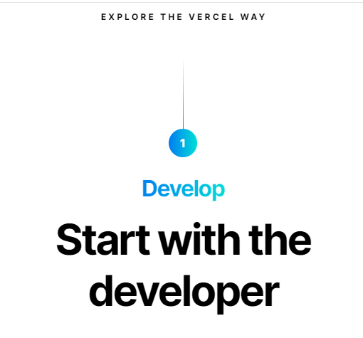

# Dom Manipulation Project :-
## 1.Website - [Dev to ](https://dev.to/)

## Tasks :-

        Target the Top description div and change the DEV Community to <Your_Name> and description to your passion


## Code-
```
document.querySelector(".side-bar .crayons-card .crayons-subtitle-2").innerText = "Sushil Gauraw"
'Sushil Gauraw'

document.querySelector(".side-bar .crayons-card .color-base-70").innerText = "Frontend Developer"
'Frontend Developer'
```
## Output


---


## 2. Website Name: [Apple](https://support.apple.com/en-in)

## Task


```
- Fetch all the product name and store in an array
```

## Output
```
let empArr = [];

document.querySelectorAll(".as-imagegrid-item").forEach((ex) => 
    empArr.push(ex.innerText.replace("\nSupport", "")));

console.log(empArr)
```
```
(7) ['iPhone', 'Mac', 'iPad', 'Watch', 'AirPods', 'Music', 'TV']
```
---
## 3. Webiste Name: [Youtube Support](https://support.google.com/youtube/)

### Topics

    - Get Element By Id, Create Element, Create Text Node, Append Child

### Sample Image


### Tasks

     Add another FAQ 'My New FAQ' to the list

## Output
```
let title = document.createElement("section")
title.innerHTML = MY NEW FAQ.
document.queryselector(".accordion-homepage").appendChild(title).
``` 


---
## 4. Webiste Name: [OnePlus](https://www.oneplus.in/support)

### Topics

     Query Selector, InnerText

### Sample Image


## Tasks

      Change the contact number

## Output


---
## 5. Webiste Name: [Samsung](https://www.samsung.com/in/offer/online/samsung-fest/)

## Topics

       getElementById, createElement, InnerText, append, setAttribute

## Sample Image


## Tasks

     Target the main div of card and change the Button text to Check out

## Output

---
## 6. Webiste Name: [Adidas](https://www.adidas.co.in/)

## Topics

    -   Query Selector, Event listeners, Changing Styles

## Sample Image


### Tasks

     Target the search box and on hover change thebackground color to red.
## code 
```
function searchBG(){
    document.querySelector(".searchinput___zXLAR").style.backgroundColor="red";
}

document.addEventListener('mouseover',change_bg);
``` 
## Output - 


---

## 7. Webiste Name: [MDN Web Docs](https://developer.mozilla.org/en-US/)

## Topics

       Form, Value, Submit

## Sample Image


## Tasks

     To Search a topic in the MDN Search bar.
     First add a text to search in the search bar and then hit the submit search button to search the docs using DOM
## code 
```function search(text) {
	let input = document.querySelector("#top-nav-search-input");
	input.value = text;
	let btn = document.querySelector(".search-form");
	btn.submit();
}
search("Css Selector");
```
## Output


----
## 8. Webiste Name: [Google](https://www.google.com/)

## Topics

       Remove Elements

## Sample Image


## Tasks

     Remove alternate languages from the home page languages listed
## code - 

```let arr = document.querySelectorAll("#SIvCob a");

[...arr].forEach((element) => {
    var array = ["தமிழ்", "ગુજરાતી", "ಕನ್ನಡ", "മലയാളം", "ਪੰਜਾਬੀ"];
    if(array.includes(element.innerText)){
        element.remove();
    }
});
```

## Output - 


---
 ## 9. Webiste Name: [Code Wars](https://www.codewars.com/)

## Topics

       Change Font Family, Color of Text.

## Sample Image


## Tasks

    Change the font family of the text to monospace and text color to the logo’s background color.

## code - 
```
document.querySelector(".content-width-extra-large .display-heading-1").style.fontFamily = "serif"

document.querySelector(".content-width-extra-large .display-heading-1").style.color = "#8B2E1D";
```
## output -


---
## 10. Webiste Name: [Freecodecamp](https://www.freecodecamp.org/)

## Topics

       querySelector, mouseover, click eventListener,  callback function, style,

## Sample Image


## Tasks -

    Target the button and change background colour on mouseover
## Code -
```function changeBG(){
    document.querySelector(".btn-cta-big .login-btn-text").style.backgroundColor = "red";
};

document.addEventListener("click", changeBG)
```

## Output


---
 ## 11. Webiste Name: [realme](https://www.realme.com/in/)

## Topics

       querySelector,style,background-image

## Sample Image


## Tasks

    change the realme logo to ineuron logo

## Output
```
document.querySelector(".wrapper .gtag .icon-logo ").style.backgroundImage = "url(https://ineuron.ai/images/ineuron-logo.png)";
```


----
## 12. Webiste Name: [Github](https://github.com/)

## Topics

       querySelector,style,background-Color

## Sample Image


## Tasks

     change the background colour of the button to blue.

## code-
```
document.querySelector(".js-repos-container h2 a").style.backgroundColor = "blue";
```
## output -


---
## 13. Webiste Name: [Hackerrank](https://www.hackerrank.com/)

## Topics

       querySelector,innerHtml

## Sample Image


## Tasks

Target the top description and change “Matching developers with great companies” to ‘JSBOOTCAMP“.
## code -
```
document.querySelector(".home22-intro-text").innerHTML ="JSBOOTCAMP";
```
## Output


---
 ## 14. Webiste Name: [Asus](https://www.asus.com/in/)

## Topics

      querySelector,style,font-size

## Sample Image


## Tasks

       change the fontsize of “Hot Deals” to 80px

## Output


## Code -
```
document.querySelector(".HotDealsAll__Heading__2fIbe").style.fontSize ="80px";
```
## 15. Webiste Name: [Dell](https://www.dell.com/en-in/shop/deals/laptop-deals?gacd=10415953-9016-5761040-285981356-0&dgc=ST&gclid=Cj0KCQjwguGYBhDRARIsAHgRm4-XUDMhhVNyHXb3s1gY4ZBzORr_d9Se-buhJwy7asyUe7YdqEA11eEaAt6UEALw_wcB&gclsrc=aw.ds&nclid=BxjBlpBQsX6pjSHh-L8YYSU77EpfXRkG1AGMB5Wbeu386ykspfrPDnfx_DdFau20)

## Topics

      querySelector,style.textAlign

## Sample Image


## Tasks

       Convert the text “G15 Gaming Laptop” from left to right

## code
```
document.querySelector(".page-title").style.textAlign ="right";
```
## output


---
 ## 16. Webiste Name: [Vercel](https://vercel.com/)

## Topics

     querySelector,innerHTMl

## Sample Image



## Tasks

      change the heading “Start with the developer” to “Start with Scratch”

## Code - 
```
document.querySelector(".section-title_title__VEDfK").innerHTML ="Start with Scratch";
```
## Output


---
## 17. Webiste Name: [Sony](https://www.sony.co.in/)

## Topics

    querySelector,innerHTMl

## Sample Image


## Tasks -

     change the button text To current Date.

## Code-
```
document.querySelector(".btn-container a").innerHTML = new Date();
```
## Output -


---
## 18. Webiste Name: [Philips](https://www.philips.co.in/)

## Topics

     querySelector,style,backgroundcolor

## Sample Image


## Tasks

    change the background colour blue to orange

## Code
```
document.querySelector(".p-footer ").style.backgroundColor ="orange";
```
## output -


---
## 19. Webiste Name: [Canon](https://in.canon/)

## Topics

          querySelector,src

## Sample Image


## Tasks

    extract the canon logo

## code -
```
document.querySelector(".logo").getAttribute("src")
```
## Output
```
'/assets/brand/logo-300-002e45a4aec98fd92899838da9d5560f.png'
```
---

## 20. Webiste Name: [Oppo](https://www.oppo.com/in/)

## Topics

          querySelector,style,color

## Sample Image


## Tasks

      Change the description colour black to orange

## Code -
```
document.querySelector("h3 .desc").style.color = "orange";
```
## Output -


---


